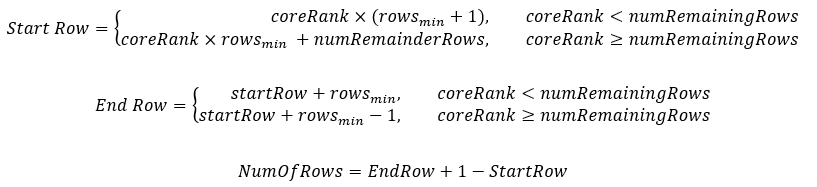
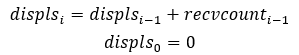
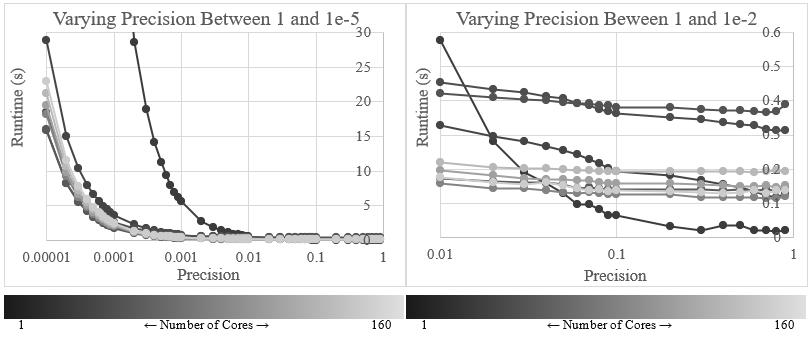
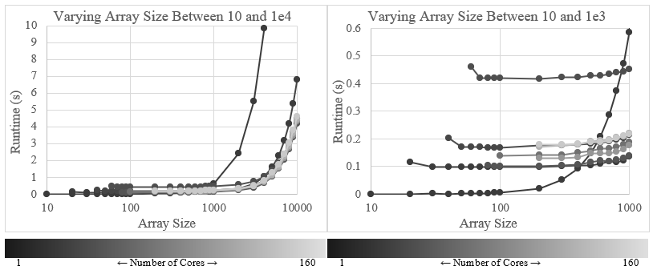
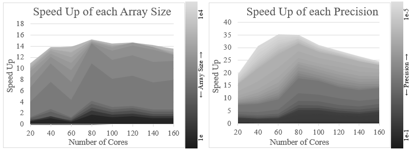
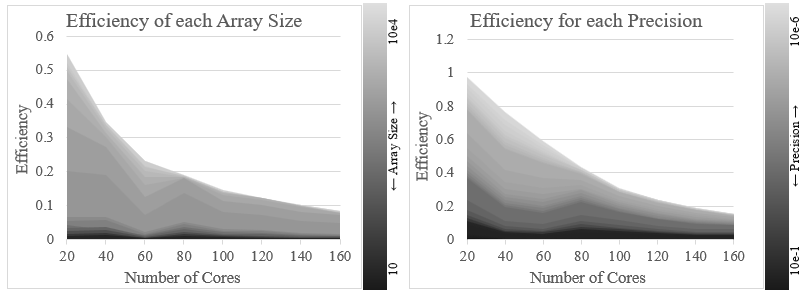
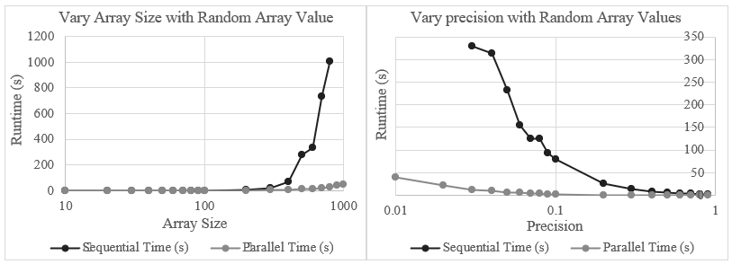

# Distributed Memory Coursework

George Madeley (gm768@bath.ac.uk)

CM30225: Parallel Computing

University of Bath

09-01-2023

## Abstract

A parallel super step like algorithm implemented on a distributed memory architecture using C and MPI with the purpose to reduce the overall runtime of computing the relaxation technique compared to a sequential implementation for varying input size and precision values. Results show that increases the array size and increase the precision resolution increases the speed up of the parallel program however, efficiency reduces. Results also show that the program achieves the best speed up when the computer uses 80 cores to compute the relaxation technique on any array size from 1e to 1e4 and any precision from 1e-1 to 1e-5. These results not only show that a parallel program on a distributed memory architecture is viable alternative to compute the relaxation technique but also shows the optimum number of cores to use.

## Introduction

A method of solving differential equations is to use the relaxation technique. The relaxation technique computes the average of each element four neighbours and stores the result in that element corresponding position in the output array, ignoring the first and last row and columns. The calculator repeats this process until the difference between all elements current and earlier values are less than a given level or precision. Due to the high computational requirements as the input array size increases and as the precision decreases, the task is to design a parallel program using C and MPI that performs the relaxation technique on a variable array’s sizes and precision values for a distributed memory architecture to achieve a smaller runtime than using a sequential program.

## Method

### Sequential Algorithm

The sequential algorithm will loop through each element in the input array (ignoring elements in the first or last column or row), calculate the average of that elements four neighbours and store the result in the elements corresponding position in the output array. Once the computer has calculated the averages of each element, the computer copies the data in the output array to the input array and the process repeats until every element reaches the given level of precision. Then, the function returns the output array, and the sequential algorithm completes.

### Sequential Testing

#### Correct Output Testing

To ensure the sequential implementation produces the correct output, the testers assessed the function using an array, of sizes varying from three-by-three to ten-by-ten, where the root core fills first column and row with ones and the rest with zeros . The function prints the output array at the end of each iteration and compared with hand calculations for each stage.
The testers conducted the same process using  the same array of size four-by-four but using varying precisions from 0.1 to 0.001.
The testers considered excessively large and small array sizes and level of precision respectfully too labour intensive to test.

#### Control Flow Testing

The algorithm must ignore elements in the first and last column and row. A print message was set up for various sizes of arrays which would print the elements x and y coordinate if that element were skipped. Table 3 shows the results.
The algorithm must also break out of the loop when all elements have reached the required level of precision.

### Parallel Algorithm

In the parallel algorithm, the root core assigns each core a given number rows to calculate the averages of. However, to calculate the averages of each element in each core top and bottom rows, each core needs values from their neighbouring cores. Therefore, before each core can calculate the averages of each row, the cores must send their bottom row to the next core and their top row to the prior core. Each core can now calculate the averages of their rows. Once done, each core repeats the process of sharing top and bottom rows with neighbouring cores to ensure each core gets the most up to date data. This process repeats until every value has reached the required level of precision. Once done, each core needs to share their sub array to ensure each core has a completed output array.

### Parallel Implementation

To start the parallel code, each core must calculate which rows the root core should assign to it and how many rows. For instance, if three cores calculate the relaxation technique on a 10 x 10 array, one core will have to calculate the averages of four rows whilst the remaining two calculate the averages of three rows. For each core to figure out this, they calculate the minimum number of rows the root core will assign every core, in this case three. Every core then calculates the number of cores remaining, in this case one. If a cores rank is less than the number of remaining rows, the root core will assign that core an extra row.
To calculate which row the root core assigns each core, each core performs the following equation:

The root core is the core that has the input array. For each core to get access to their rows, the root core must scatter the rows to each core. However, due to the variable number of rows the program has assigned each core, the root core must use a variable scatter. Before the root core can use the variable scatter, it must first gather all the cores allocated number of rows into a list, named counts, ordered by core rank. Using this data, the root core calculates the index in the input array where each cores rows start using Equation 1 and stores these values in an array called displs. Once the root core has created the counts and displs arrays, the root core scatters the rows across the cores.

    double sub_arr[size * (num_of_rows + 2)];
    int num_of_ele = (int)(size * num_of_rows);
    int *displs = NULL;
    int *counts = NULL;
    if (core_id == 0) {
      counts = (int *)malloc(sizeof(int) * (unsigned int)num_cores);
    }
    MPI_Gather(&num_of_ele, 1, MPI_INT, counts, 1, MPI_INT, 0, MPI_COMM_WORLD);
    if (core_id == 0) {
      displs = (int *)malloc(sizeof(int) * (unsigned int)num_cores);
      displs[0] = 0;
      for (int i = 1; i < num_cores; i++) {
        displs[i] = displs[i - 1] + counts[i - 1];
      }
    }
    MPI_Scatterv(
      ptr_in_arr, counts, displs, MPI_DOUBLE,
      &sub_arr[size], num_of_ele, MPI_DOUBLE, 
      0, MPI_COMM_WORLD
    );

Each core stores their rows and space for their neighbours’ rows in an array termed sub array. Each core must then send their top row to the previous core and their bottom row to the next core whilst also wait to receive a row from the next and previous cores . To achieve this, each core runs a for loop ranging from 0 to the total number of cores. If a cores rank matches the iterator value ± 1, the program forces the core to wait to receive a row. However, if a cores rank matches the iterator, the core sends their bottom row to the next core and their top row to the previous core.

    if (num_cores > 1) {
      for (int core_num = 0; core_num < num_cores; core_num++) {
        int next_core_num = (core_num + 1) % num_cores;
        int prev_core_num = core_num != 0 ? core_num - 1 : num_cores - 1;

        if (core_id == prev_core_num) {
          // Wait to receive a row from the next core.
        } else if (core_id == core_num) {
          // Send the top row to the previous core.
          // Send the bottom row to the next core.
        } else if (core_id == next_core_num) {
          // Wait to receive a row from the previous core.
        } else {
          continue;
        }
      }
    }

If a cores rank does not equal to the iterator or the iterator ± 1, then the core continues to the next iteration. This will repeat until the core has to wait for a row from the next core. Once a core has sent their two rows and received two rows, it no longer must wait in a send or receive function and leaves the loop. Once each core as received their neighbours’ rows, they can leave the loop and calculate the averages of their elements.

To calculate the average of each element in a core assigned rows, each core loops through each element, calculates the average and stores it in that element corresponding position in an output array. The first and last core ignore their top and bottom row respectfully whilst every core ignores values in the first and last column of each row.

Each core has a variable, termed local precision, which holds the value (ϵ {0, 1}) of whether all the cores’ elements have reached the required level of precision. During the average calculation, each core calculates the difference between each element current and new value and if that value is not less than the level of precision, the core overwrites the value of local precision to 0. Else, the value of local precision stays the same. Once a core has finished calculating the averages of each element in their assigned rows, it must send its local precision value to the root core which then decides  if every core sub array has reached the required level of precision. The root core then broadcasts whether the array has reached the required level of precision. The root core performs this action to stop deadlocks in case one core reaches the required level of precision and leaves the while loop whilst its next and previous cores are stuck in a deadlock waiting for the afomentioned core to send them its rows.

    // Calculates the averages
    double avg_arr[size * num_of_rows];
    memcpy(&avg_arr, &sub_arr[size], sizeof(double) * size * num_of_rows);
    calculate_averages(
      sub_arr,
      avg_arr,
      precision,
      &is_precise,
      num_of_rows,
      size
    );
    memcpy(&sub_arr[size], avg_arr, sizeof(double) * size * num_of_rows);

    // Sends the local precision value to the root core for it to determine
    // whether each core needs to repeat the average calculations again.
    unsigned int global_is_precise = 0;
    MPI_Reduce(...);
    is_precise = global_is_precise == 1 ? 1 : 0;

    // Root core broadcasts to all cores whether they need to repeat the 
    // average calculations.
    MPI_Bcast(&is_precise, 1, MPI_UNSIGNED, 0, MPI_COMM_WORLD);

The final part of the algorithm is for each core to sends its sub array to the root core to create a complete array. The root core uses a variable gather and the arrays created for the variable scatter to gather all the rows from each core into the output array.

Once each core has run the parallel and sequential implementations, each core compares outputs of the sequential and parallel implementations. If the outputs match, the program presumes parallel implementation is correct.

To time the sequential implementation, the program uses the clock() function from time.h to record the start and end times of sequential function. As each core runs through the sequential implementation, each core will get different times, therefore, each core will calculate the difference between their start and end times and send them to the root core. The root core uses a reduce addition to sum together all the time then divide them by the total number of cores to calculate the average runtime of sequential function across all cores. The root core broadcasts this to all cores.

A similar issue arises with timing the parallel implementation. One core could start the parallel implementation before any other cores whilst another core (or the same core) could finish the parallel implementation after all the others. To calculate the true runtime of the parallel implementation each core sends their start and end times to the root core. The root core uses a reduce minimum to find the start time of the first core and a reduce maximum the find the end time of the last core. The root core calculates the difference between these two values and broadcasts it to all cores.

### Parallel Testing

#### Correctness Testing

To assess if the parallel implementation output is correct, the tester conducted 100 tests for each array size varying from 10 to 10000 logarithmically with a precision of 0.1. The testers compared the output of the parallel and sequential implementations and if they matched, the parallel output would be correct.

An error occurred at once during the comparison as the comparison function found three elements in a ten-by-ten array that did not match. Print messages did not help as they showed that the values did match. On further investigation, the sequential algorithm would determine if an element is precise enough when the difference of that elements current and previous value was less than the given level of precision however, the parallel algorithm would determine is an element is precise enough when the difference between an elements current and previous value is less than or equal to the given level of precision. The programmer fixed this difference of the relation operator, and the testers reconducted the tests; this time passing.

The testers also conducted 100 tests for each level of precision varying from 0.1 to 0.0001 logarithmically with an array size of 1000. The testers compared the output of the parallel and sequential implementations and if they matched, the parallel output would be correct.
100 tests were also conductions for different number of cores varying from 5 to 175 in steps  of 5 with an array size of 100 and precision of 0.1. The testers applied the same procedure.

When the number of cores exceed the number of rows, the tests began to fail. This was due to the passing of rows between neighbouring cores. For instance, if there were 15 rows and 20 cores, the root core will assign the first 15 cores a row whilst the remaining 5 will not be. When passing their top and bottom rows to neighbouring cores, the first 15 cores will pass successfully however, the remaining 5 will not. This causes the error. However, it is exceedingly rare for there to be more cores than there are rows, but it is still possible. The programmer added an if statement to check if the total number of cores exceed the total number of rows. If so, the computer does not execute the parallel program, and the test will fail instead of causing deadlocks. The test was reconducted all ran producing the correct output.

#### Scalability Testing

Gustafsons states that increasing the size of the problem, the efficiency should increase whilst Amdahl states that increasing the number of cores decreases the efficiency. Testers conducted tests based around these statements. The testers used the same number of cores each node to ensure the same conditions when passing messages at higher number of cores.

##### Precision Testing

By decreasing the level of precision logarithmically from 1e-1 to 1e-5, we can see that the runtime increasing exponentially. This is because the level or precision is inversely proportional to the number of iterations of the code each core must run. In each iteration, each core must send their top and bottom row to their neighbouring cores and wait for rows as well. The more iterations, the more data each core must pass hence the more time taken up. As we increase the number of cores, the runtime initially decreases but then increases linearly. The testers expected this as the more cores there are, the more time spent sending and waiting to receive neighbouring cores rows. In addition to the time taken up by passing data, the process of sending and receive data acts like a soft barrier. In a normal barrier, all cores would have to reach the barrier before any core could continue, however, in this case, a core only needs its two neighbouring cores to reach the barrier before it can continue. The issue is this is recursive. As we decrease the level of precision, inversely increase the number of iterations, the time spent waiting at the barrier like construct increases causing the efficiency to decrease.

##### Array Testing

As one increases the size of the input array  logarithmically from 10 to 10e3, the runtime increases exponentially after 1000 x 1000. The larger runtime is due to the size of the messages each core passes to each neighbouring core; the larger the data a core passes, the larger time taken to pass the message. As one varies the number of cores used to process each job, the runtime decreases between 20 and 80 cores then increases after 80 cores. The first decreases are due to the reduced amount of work the root core assigns to each core. However, the increase is due to the increased number of messages each core passes to their neighbouring cores. The highest relative runtime is when the computer uses 60 cores to process the program.

#### Speed-up

The tested calculated and graphed the speed up for each number of cores used and the input array size/level of precision. The graphs show that as you increase the array size (or decrease the level of precision) the speed up increases for every number of cores used. This is due to each receiving the same proportion of the problem but a large size hence the computer performs more calculations in parallel.

The speed up for each level of precision initially increases then decreases as the number of cores increases. The first increase is due to each core getting a smaller number of elements to calculate therefore reducing the runtime for each core. However, when the computer uses more than 80 cores, the speed up begins the decreases. This decrease is because of the increases number of message passing; the more cores, the more message passing each iteration.

The speed up for each array size initially increases but then variation in speedup reduces. However, when 60 cores have the smallest speedup.

By investigating the speed-up results for the scalability tests, we can see that the best speed up is when the computer uses 80 cores to compute the solution. This is because the total time taken up computing the averages of each assigned value and the time spent passing messages per core is the lowest.

#### Efficiency

We can see from the efficiency graphs that as the number of cores increases, the efficiency decreases. This is due to the increased number of cores waiting at the soft barrier when sharing rows to neighbouring cores at the start of each iteration and when the root core gathers the precision level of each core. As the number of cores increases, the number of messages increases, hence, the longer the wait time for cores needing to send or receive data and for cores waiting to send their precision to the root core. In addition to this, as the number of cores increases, the possibility of their being a large variation in processor speeds.

As the array size increases, the more data each core is passing to each neighbouring core. This increases the time it takes for a core to send a message to a neighbouring core. Therefore, the efficiency when varying array size is steeper and smaller than the efficiency when varying the required level of precision.

#### Varying Input Array Type

From the speed up graphs, the testers observed that the best speedup is when the computer sues 80 cores to process the program. However, this is only for array type one. Therefore, the testers conducted tests on array type zero which assigns a random number between zero and nine inclusive to each element in the array.

The sequential results only go up to 1006.07 seconds for the array size tests and 329.34 seconds for the precision test, this is because tests on the sequential implementation that used array sizes larger than 900 and precision smaller than 0.08 caused runtime errors on the cluster as the runtime exceeded 20 minutes. However, the gathered results show that as the complexity of the array increased, the speed up also increased.

## Conclusion

The parallel algorithm implemented to perform the relaxation technique on a distributed memory architecture uses a superstep like design where each core computes the averages of their assigned values then shares a proportion of these values with their neighbouring cores until every value has reached the required level of precision. Due to the communication wait times when cores send and receive rows from their neighbouring cores, the efficiency decreases as the array size increases and as the precision decreases. However, As the array size exceeds a size of 500 and the precision exceeds 0.02, the speed up becomes larger than 1. By analysing the runtime whilst varying number of cores, precision, and array size, testers observed that 80 cores are the most suitable number of cores for the HPC cluster to use to compute the relaxation technique on any array size up to 10000 and precision down to 0.00001.
